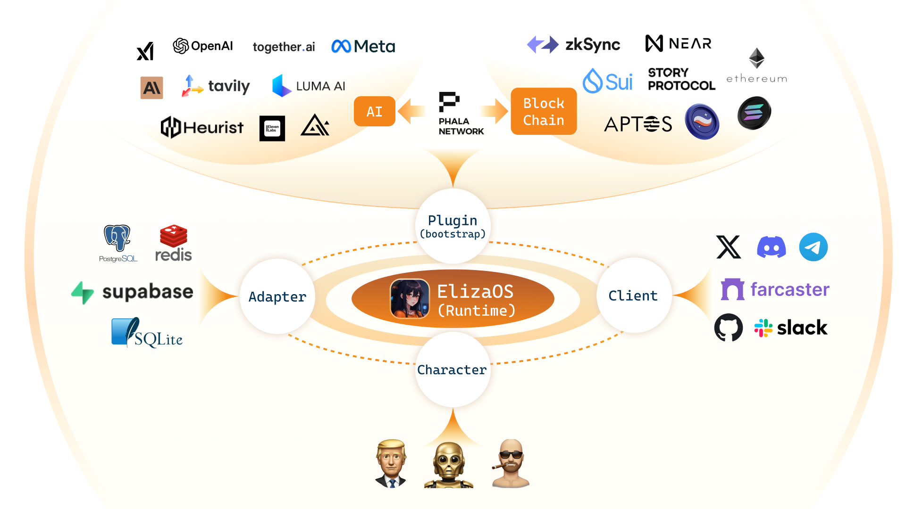

# Eliza 🤖

<div align="center">
  
</div>

<div align="center">

📖 [Documentation](https://elizaos.github.io/eliza/) | 🎯 [Examples](https://github.com/thejoven/awesome-eliza)

</div>


## 🚩 Overview

<div align="center">
  
</div>

## ✨ Features

- 🛠️ Full-featured Discord, Twitter and Telegram connectors
- 🔗 Support for every model (Llama, Grok, OpenAI, Anthropic, etc.)
- 👥 Multi-agent and room support
- 📚 Easily ingest and interact with your documents
- 💾 Retrievable memory and document store
- 🚀 Highly extensible - create your own actions and clients
- ☁️ Supports many models (local Llama, OpenAI, Anthropic, Groq, etc.)
- 📦 Just works!


## 🚀 Quick Start

### Prerequisites

- [Python 2.7+](https://www.python.org/downloads/)
- [Node.js 23.3.0](https://docs.npmjs.com/downloading-and-installing-node-js-and-npm)
- [pnpm 9.14.4](https://pnpm.io/installation)

> **Note for Windows Users:** [WSL 2](https://learn.microsoft.com/en-us/windows/wsl/install-manual) is required.

Then read the [Documentation](https://elizaos.github.io/eliza/) to learn how to customize your Eliza.

### Manually Start Eliza

```bash
# Clone the repository
git clone git@github.com:Blockchains-Princeton/eliza-ECE473-project.git

# Checkout to this version
git checkout ECE473-project-Eliza
```

### Edit the .env file

Copy .env.example to .env and fill in the appropriate values.

```
cp .env.example .env
```

Note: .env is optional. If you're planning to run multiple distinct agents, you can pass secrets through the character JSON
Note: .env is optional. If you're planning to run multiple distinct agents, you can pass secrets through the character JSON


### Edit the character file

1. Open `agent/src/defaultCharacter.ts` to modify the default character.
2. Note that the default character is using `clients: [Clients.TELEGRAM, Clients.DISCORD]` which makes it possible to interact with the agent via Telegram and Discord


### Get Telegram credentials and add it to the .env file

1. In telegram search for `@BotFather`
2. Follow the instructions by entering `\start` and `\newbot` and entering a name for the bot to create the bot credentials.
3. It will give you a HTTP API access token, paste it to the .env file at `TELEGRAM_BOT_TOKEN=...`
4. Click on the provided bot address to be redirected to the bot.


### Get Discord credentials and add them to the .env file

1. Go to Discord developer portal `https://discord.com/developers/applications`
2. Create a new application
3. From the left sidebar go to `Bot` and click on `Reset Token`, Copy the created token and paste it into the .env file at `DISCORD_API_TOKEN=...`
4. From the left-hand side bar go to `OAuth2` and choose `bot` under OAuth2 URL Generator.
5. Under `BOT PERMISSIONS` check all the text permissions.
6. Copy the generated URL, This is the URL you’ll navigate to in order to add your bot to a server.
7. Go to the `General information` tab from the left-hand side bar and copy the application ID into the `DISCORD_APPLICATION_ID=...` field of the .env file.

If you need more information refer to `https://www.writebots.com/discord-bot-token/`.


### Manually Start Eliza
Every time any of the dependencies change you need to `pnpm i` again and every time you make any changes in the project source code you need to run `pnpm build`
```bash
pnpm i
pnpm build
pnpm start
```
After starting the bot you should be able to chat with it on Telegram or on any discord server you added the bot to.

```
# The project iterates fast, sometimes you need to clean the project if you are coming back to the project

pnpm clean
```
### Plugins
The default character is powered by DAI plugin which is a customized simple plugin that reports the DAI balance of the address that is mentioned by the user. For instance, ask Eliza to report to you the DAI balance of address "0x47ac0Fb4F2D84898e4D9E7b4DaB3C24507a6D503", it should report 35,999,972.

#### Developing a Custom Plugin

Here you will learn step by step how to create a custom plugin, you will start by using the `plugin-dai` which is a plugin for accessing the DAI balance of a user and you will build on it to access both the balance and nonce of the user. 
To create a custom plugin, follow these steps:

1. **Create a Folder**
   - Inside the `packages` directory, create a new folder for your plugin:
     ```sh
     mkdir packages/plugin-yourplugin
     ```

2. **Reuse Configuration Files**
   - You can use the existing configuration files from `plugin-dai`:
     - `package.json`
     - `tsconfig.json`
     - `tsup.config.ts`

3. **Modify the Plugin Details**
   - Update the **plugin name, description, and dependencies** in `package.json` to reflect your new plugin.

4. **Update Dependencies**
   - The `plugin-dai` requires **Node and Ethers** to interact with the Ethereum blockchain.
   - Your plugin may not need these and might require different dependencies instead.
   - Adjust the configuration files accordingly.


5. **Creating the src directory**
To structure your plugin properly, create a `src` folder inside `plugin-yourplugin`.
Copy the following files into your `src` directory:

- `environment.ts`
- `index.ts`
- `types.ts`
- `services.ts`
- `examples.ts`

The `environment.ts` file determines which environment variables are required for this plugin to function. In this case, only the **DAI address** and the **Infura API key** are needed.
The `types.ts` file contains the data types that will be used in your plugin code.
The `examples.ts` file contains example code demonstrating user-agent interaction, which should invoke this plugin.
The `services.ts` file contains the main service logic of the plugin. In this case, it:
- Creates an instance of the **DAI smart contract**
- Sets up the **JSON-RPC provider**
- Reads the balance of the determined address
If this seems confusing, you can postpone this step until we read the `actions` folder and then return to it again.
The `index.ts` file defines the **DAI balance checker plugin** for Eliza. It uses `Plugin` from `@elizaos/core` to structure the plugin. It registers `getDaiBalanceAction`, which fetches the DAI balance. It includes `name` and `description` for identification. And finally, it exports `daiPlugin` as the default for integration.

The `actions` folder contains all the actions that the plugin can perform. In this case, our plugin has **one action**, which is fetching the **DAI balance** of a given Ethereum address.

6. **Creating the actions directory**
Inside the `actions` folder, create separate files for every distinct action your plugin does. For instance, the DAI plugin only has one action which is getting the DAI balance.
This is the main body of your plugin where you define how the plugin uses the context of the agent `message` and the environment variables `config` to carry on the main functionality, this function uses the function developed in the `service.ts` file and handles errors as well.

7. **practice**
   As a practice, change the service file and the action file to report both the balance and the nonce of the user. The DAI smart contract exposes the read function `nonces` that can be used the same way the `balanceOf` function was used. Once you did this, submit teh modified `services.ts` and `getDaiBalance.ts` on canvas.

### Clients
If you need to edit how the agent responds in a specific client, find the corresponding client in `./packages` and in `src/templates.ts` edit the prompt that dictates how it should react in different clients.


